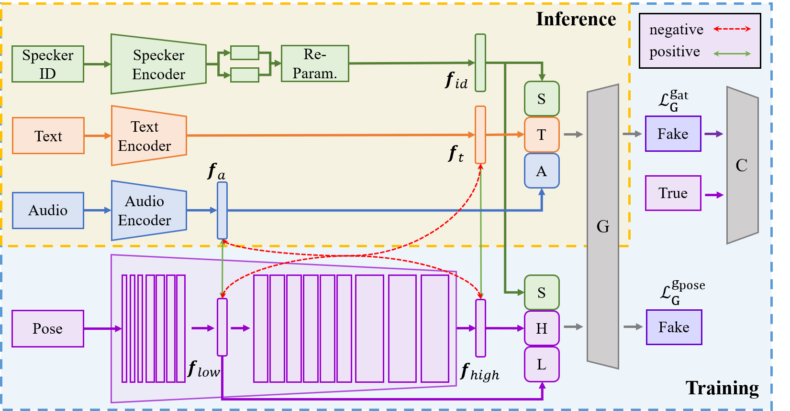
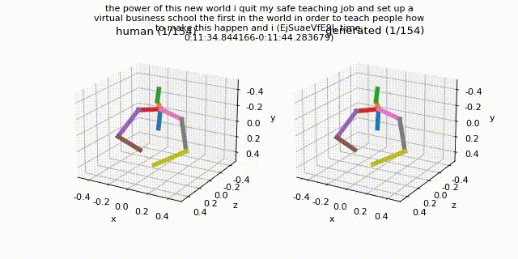
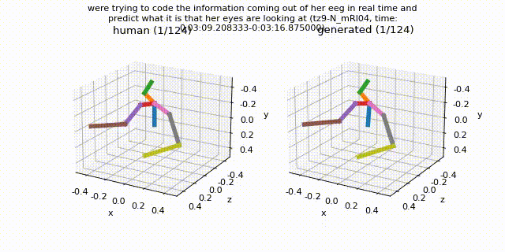

# MULTIMODAL JOINT EMBEDDING FOR CO-SPEECH GESTURE GENERATION

The automatic synthesis of realistic co-speech gestures is becoming increasingly important and challenging. Previous studies have tended to generate gestures directly from audio and text, ignoring the rich multimodal information in gestures. Such a straightforward pipeline fails to learn the mapping relationship between text-audio and gesture. In this study, we propose a novel framework named Multimodal Joint Embedding for Gesture (MJEG) for co-speech gesture generation. In MJEG, a hierarchical gesture encoder extracts gesture representations across multimodal. In order to create realistic and vivid co-speech gestures, the model learns two joint embeddings for both gesture-audio and gesture-text. Furthermore, we propose an embedding alignment quadruplet contrastive learning strategy to improve the alignment of the joint embedding space. We use WGAN-GP for adversarial training and a novel asymmetric training approach to accelerate and balance GAN learning. Extensive experiments show that the proposed method produces realistic co-speech gestures and outperforms previous methods significantly.

Generated Sample
============

## Acknowledgement
* The codebase is developed based on [Gesture Generation from Trimodal Context](https://github.com/ai4r/Gesture-Generation-from-Trimodal-Context) of Yoon et al.

Copyright Information
============
This project is only for research or education purposes, and not freely available for commercial use or redistribution.
